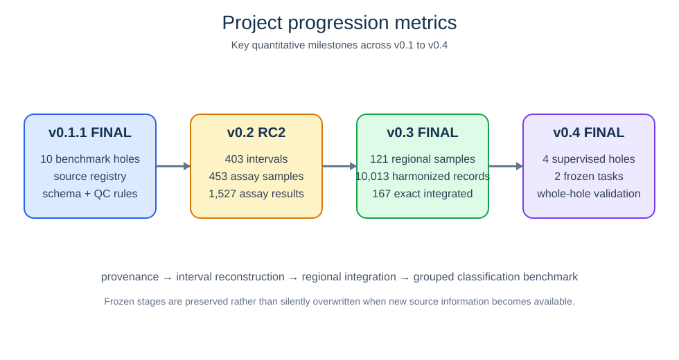
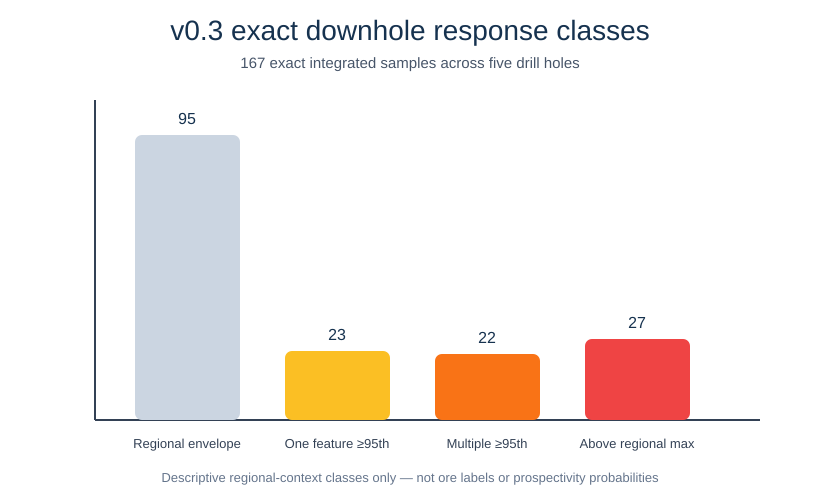
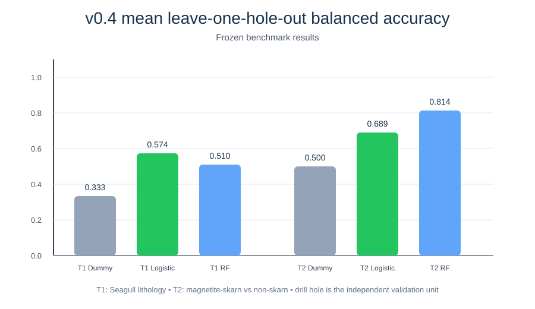

# Canadian Drill-Core Data Workflow

**An independent, reproducible workflow for drill-core data readiness, provenance, geological and geochemical integration, downhole analysis, and leakage-controlled machine-learning benchmarking.**

This repository documents a research workflow I developed using public Canadian geoscience data. It is organized as a staged, versioned project so that source evidence, data transformations, geological interpretation, and model evaluation remain traceable and reproducible.

## Research question

**Can heterogeneous public Canadian drill-core records be transformed into a provenance-preserving, quality-controlled, analysis-ready geological database that can later accept hyperspectral, XRF, LIBS, petrophysical, mineralogical, and core-image data?**

The current pilot focuses on Ontario Midcontinent Rift Ni-Cu-PGE drill-core and regional geochemical data around the **Disraeli-Seagull** area.

## Workflow

See the **[detailed Mermaid workflow](docs/WORKFLOW_MERMAID.md)** for the complete v0.1 → v0.4 logic, including each v0.3 substage and the frozen v0.4 benchmark design.



## What the project demonstrates

| Stage | Purpose | State |
|---|---|---|
| **v0.1.1** | Source readiness, provenance, schema, QC rules, 10-hole benchmark | FINAL |
| **v0.2** | PDF-derived drill-hole intervals, assays, surveys, censoring and source QC | RC2 — PDF-complete, source constraints open |
| **v0.3** | Regional integration, geochemical harmonization, interval/lithology linkage, downhole and cross-hole synthesis | FINAL |
| **v0.4** | Pre-declared labels/features, leakage control, leave-one-hole-out baseline classification | FINAL |

### Current quantitative state

- **10** benchmark drill holes.
- **403** lithology/geological interval rows.
- **453** assay-sample records and **1,527** assay-result rows.
- **121** canonical regional geochemical samples and **8,486** regional geochemical results.
- **10,013** harmonized analytical records.
- **345** exact sample-to-lithology assignments.
- **167** exact integrated downhole samples across **5** holes.
- **4** holes enter the frozen supervised v0.4 benchmark.

## v0.3 integration sequence

The v0.3 release is intentionally split into five traceable scientific stages:

1. **v0.3.1 — Regional integration:** system linkage, regional whole-rock geochemistry, isotope context, nearby mineral-inventory context, and independent metric reproduction.
2. **v0.3.2 — Geochemical harmonization:** shared Ni-Cu-Co-Au-Pd-Pt feature layer, unit normalization, censor preservation, and method-aware comparison rules.
3. **v0.3.3 — Interval-geochemistry integration:** exact sample/lithology joins, boundary-confidence handling, and same-system regional-position calculations.
4. **v0.3.4 — Downhole context:** measured-depth profiles, descriptive response classes, touching/overlapping clusters, and lithology-package summaries.
5. **v0.3.5 — Cross-hole synthesis:** explicit comparability tiers, same-method vs broader contextual comparison, and cross-hole signature summaries.



See [`docs/V0_3_SCIENTIFIC_SYNTHESIS.md`](docs/V0_3_SCIENTIFIC_SYNTHESIS.md).

## Frozen v0.4 benchmark

Two deliberately conservative geological classification tasks were defined **before model fitting**:

1. **T1 — Seagull lithology:** gabbroic vs diabase vs mafic intrusive using log Ni-Cu-Co; whole-hole transfer between SN12-01 and SN12-02.
2. **T2 — Disraeli/Caro Lake magnetite-skarn:** magnetite skarn vs non-skarn using log Ni-Cu-Co; whole-hole transfer between U-17-01 and U-17-02.

Primary mean leave-one-hole-out balanced accuracy:

| Task | Dummy | Logistic regression | Random forest |
|---|---:|---:|---:|
| T1 — SEA lithology | 0.333 | **0.574** | 0.510 |
| T2 — DIS skarn | 0.500 | 0.689 | **0.814** |



The T2 strict single-lithology subset reaches ~0.897 mean balanced accuracy with the fixed random-forest baseline, but this is based on only two independent holes and includes a hole-plus-analytical-method domain shift. **These scores are methodological benchmarks, not ore probabilities or prospectivity rankings.**

Detailed v0.4 documentation:

- [`V0_4_SCIENTIFIC_SYNTHESIS.md`](docs/V0_4_SCIENTIFIC_SYNTHESIS.md)
- [`FROZEN_BENCHMARK_PROTOCOL.md`](docs/FROZEN_BENCHMARK_PROTOCOL.md)
- [`FROZEN_LEAKAGE_REGISTER.md`](docs/FROZEN_LEAKAGE_REGISTER.md)
- [`MODEL_AUDIT.md`](docs/MODEL_AUDIT.md)

## Public demonstration notebooks

The repository includes lightweight examples that can be run without redistributing the original source packages:

- `01_source_readiness_demo.ipynb`
- `02_interval_qc_demo.ipynb`
- `03_regional_integration_demo.ipynb`
- `04_classification_benchmark_demo.ipynb`

They use small synthetic tables plus compact public summary products to demonstrate the workflow logic.

## Scientific guardrails

- No random interval train/test splitting in the frozen benchmark.
- No target label derived from the same assay variables used to predict that label.
- No hyperparameter optimization against held-out benchmark holes.
- Censored values retain qualifier/detection-limit semantics; they are not silently replaced by half the detection limit.
- Unit harmonization is **not** treated as analytical-method equivalence.
- No 3-D borehole trajectories are reconstructed where survey data are incomplete.
- No v0.4 model is claimed to perform ore targeting, prospectivity ranking, or deposit ranking.

## Repository structure

```text
docs/       methods, detailed workflow, scientific syntheses and frozen policies
figures/    selected workflow and benchmark figures
src/        reusable provenance/QC/harmonization/integration/benchmark code
data/       public source registry, compact summaries and synthetic examples
schema/     database schemas and public data dictionary
notebooks/  runnable public demonstrations
tests/      unit tests
releases/   lineage and release notes
```

## Quick start

```bash
python -m venv .venv
source .venv/bin/activate        # Windows: .venv\Scripts\activate
pip install -e .[dev]
pytest -q
```

## Data access

Original assessment reports and regional source datasets are **not bundled**. The public source registry records source identifiers and authoritative access locations. Third-party geoscience data remain outside the repository license.

## Future extensions

The architecture is deliberately modality-ready. Future work can add hyperspectral, pXRF/uXRF, LIBS, petrophysical, mineralogical, core-image, and other drill-core modalities while retaining the same provenance, interval-registration, QC, and grouped-validation principles.

## Releases and citation

- [`releases/LINEAGE.md`](releases/LINEAGE.md)
- [`releases/RELEASE_NOTES.md`](releases/RELEASE_NOTES.md)
- `CITATION.cff`

Original project code and documentation are released under the MIT License unless a file states otherwise.
