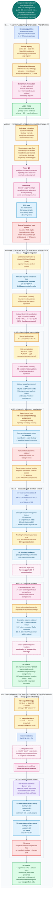

# Detailed workflow (Mermaid)

This diagram documents the staged independent workflow from source readiness through the frozen v0.4 benchmark.

```mermaid
%%{init: {'theme':'base','flowchart':{'curve':'basis','nodeSpacing':28,'rankSpacing':42},'themeVariables':{'fontFamily':'Arial','fontSize':'14px','lineColor':'#64748B','clusterBkg':'#F8FAFC','clusterBorder':'#CBD5E1'}}}%%
flowchart TB

START(["Independent Canadian drill-core data workflow<br/><b>Aim:</b> turn heterogeneous public drill-core records into a provenance-preserving,<br/>QC-controlled and analysis-ready geological framework"]):::anchor

subgraph V01["v0.1 → v0.1.1 FINAL | SOURCE READINESS & PROVENANCE"]
direction LR
A11["<b>Source acquisition</b><br/>assessment reports<br/>regional/context datasets<br/>U-17-02 source package"]:::input
A12["<b>Source registry</b><br/>source IDs + local files<br/>SHA-256 checksums<br/>document/page provenance<br/>gap register"]:::process
A13["<b>Relational architecture</b><br/>drillhole • survey • lithology<br/>alteration • mineralization<br/>assay sample/result • QC issue"]:::process
A14["<b>Benchmark foundation</b><br/>10 holes selected<br/>manual verification<br/>raw + normalized values retained<br/>traceability required"]:::qc
A15["<b>v0.1.1 FINAL</b><br/>all 10 holes have local<br/>primary-source evidence<br/>schema + QC + manifest frozen"]:::release
A11 --> A12 --> A13 --> A14 --> A15
end

subgraph V02["v0.2 RC2 | PDF-DERIVED INTERVAL RECONSTRUCTION & QC"]
direction LR
B21["<b>Hole-level extraction</b><br/>collars + metadata<br/>lithology intervals<br/>assay intervals/results<br/>recoverable surveys"]:::process
B22["<b>Source-aware parsing</b><br/>complex layouts retained<br/>nested intervals retained<br/>no invented decimals<br/>image-only tables flagged"]:::process
B23["<b>Assay QC</b><br/>qualifiers such as &lt;5 preserved<br/>repeat/QC rows classified<br/>method + units retained"]:::qc
B24["<b>Interval QC</b><br/>bounds • gaps • overlaps<br/>sample/lithology alignment<br/>survey ordering<br/>source anomalies preserved"]:::qc
B25["<b>RC2 state</b><br/>403 interval rows<br/>453 assay samples<br/>1,527 assay results<br/>11 survey rows"]:::output
B26["<b>Source limitations kept explicit</b><br/>truncated 2021 depths<br/>incomplete gyro data<br/>image-only DL14 assays<br/>ambiguous U-17-02 survey columns"]:::risk
B21 --> B22 --> B23 --> B24 --> B25 --> B26
end

subgraph V03["v0.3 FINAL | GEOLOGICAL & GEOCHEMICAL INTEGRATION"]
direction TB

subgraph V031["v0.3.1 — Regional integration"]
direction LR
C311["Link benchmark holes to<br/>Disraeli (DIS) and Seagull (SEA)<br/>regional intrusion-system context"]:::process
C312["MRD308 regional whole-rock data<br/><b>121 canonical samples</b><br/>DIS 55 • SEA 66<br/><b>8,486 geochemical results</b>"]:::output
C313["Add isotope + nearby<br/>mineral-inventory context<br/>while preserving source separation"]:::process
C314["Independent QC reproduction<br/>Mg# • La/SmN • Gd/YbN<br/>Th/Nb • Th/La • Ni • Cu • Cu/Pd<br/><b>16/16 checks reproduced</b>"]:::qc
C311 --> C312 --> C313 --> C314
end

subgraph V032["v0.3.2 — Geochemical harmonization"]
direction LR
C321["Shared analyte layer<br/>Ni • Cu • Co • Au • Pd • Pt"]:::process
C322["Unit normalization<br/>Ni/Cu/Co → ppm<br/>Au/Pd/Pt → ppb<br/>raw values always retained"]:::process
C323["Censor-aware handling<br/><b>493 censored observations</b><br/>no half-detection-limit imputation"]:::qc
C324["Method-aware harmonized state<br/><b>10,013 analytical records</b><br/>574-row common analysis matrix<br/>unit match ≠ method equivalence"]:::output
C321 --> C322 --> C323 --> C324
end

subgraph V033["v0.3.3 — Interval ↔ lithology ↔ geochemistry"]
direction LR
C331["Exact interval joins<br/><b>345 exact sample/lithology assignments</b><br/>336 single-primary<br/>9 primary-boundary crossing"]:::process
C332["Strongest integrated subset<br/><b>167 samples</b><br/>exact depth + exact lithology<br/>+ populated shared chemistry"]:::output
C333["Partial-information rows retained<br/>rather than forced into<br/>false precision"]:::risk
C334["Same-system regional position<br/>empirical percentiles + robust context<br/>1,779 positions<br/>1,681 defensible comparisons"]:::process
C331 --> C332 --> C333 --> C334
end

subgraph V034["v0.3.4 — Measured-depth downhole context"]
direction LR
C341["167 exact samples across 5 holes<br/>DL-21-004 • SN12-01 • SN12-02<br/>U-17-01 • U-17-02"]:::input
C342["Descriptive regional-response classes<br/>95 envelope<br/>23 single-feature ≥95th<br/>22 multi-feature ≥95th<br/>27 above supplied regional max"]:::output
C343["Touching/overlapping samples only<br/>0.01 m numerical tolerance<br/><b>23 response clusters</b>"]:::process
C344["<b>48 lithology packages</b><br/>package chemistry summaries<br/>and response coverage"]:::output
C345["Measured depth only<br/><b>No unsupported 3-D reconstruction</b>"]:::guard
C341 --> C342 --> C343 --> C344 --> C345
end

subgraph V035["v0.3.5 — Cross-hole synthesis"]
direction LR
C351["Comparability tiers A–D<br/>24 same-system pair-feature comparisons<br/>8 direct same-method comparisons"]:::qc
C352["Cross-hole regional-percentile<br/>signatures + response coverage"]:::process
C353["Descriptive patterns retained<br/>SN12 pair = cleanest method match<br/>U17 holes = repeated Cu/Co upper tails<br/>DL-21-004 = Cu/Pd upper-tail gabbro subset"]:::output
C354["Cross-system response fractions<br/><b>not fertility or prospectivity rankings</b>"]:::guard
C351 --> C352 --> C353 --> C354
end

C314 --> C321
C324 --> C331
C334 --> C341
C345 --> C351
C3F["<b>v0.3 FINAL</b><br/>121 regional samples • 10,013 harmonized records<br/>345 exact sample/lithology assignments<br/>167 exact integrated samples across 5 holes<br/>frozen pre-ML integration foundation"]:::release
C354 --> C3F
end

subgraph V04["v0.4 FINAL | LEAKAGE-CONTROLLED CLASSIFICATION BENCHMARK"]
direction TB
subgraph V041["v0.4.1 — Design frozen before fitting"]
direction LR
D411["<b>T1 Seagull lithology</b><br/>SN12-01 ↔ SN12-02<br/>3 classes<br/>primary n=59 • strict n=57"]:::process
D412["<b>T2 magnetite-skarn</b><br/>U-17-01 ↔ U-17-02<br/>binary task<br/>primary n=49 • strict n=46"]:::process
D413["Locked predictors<br/>log10 Ni • Cu • Co"]:::input
D414["Leakage exclusions<br/>no hole ID • depth • coordinates<br/>lithology text • response fields<br/>or analytical-method label"]:::guard
D415["Validation unit = drill hole<br/><b>leave-one-whole-hole-out</b>"]:::qc
D411 --> D412 --> D413 --> D414 --> D415
end
subgraph V042["v0.4.2 — Fixed baseline models"]
direction LR
D421["Pre-declared baselines<br/>Dummy prior<br/>balanced logistic regression<br/>balanced random forest<br/>no tuning on held-out holes"]:::model
D422["<b>T1 mean balanced accuracy</b><br/>Dummy 0.333<br/>Logistic <b>0.574</b><br/>RF 0.510<br/>preliminary fold-sensitive signal"]:::output
D423["<b>T2 mean balanced accuracy</b><br/>Dummy 0.500<br/>Logistic 0.689<br/>RF <b>0.814</b><br/>strict RF ≈ 0.897"]:::output
D424["T2 caveat<br/>analytical method changes with hole<br/>so transfer is geology + domain shift"]:::risk
D421 --> D422 --> D423 --> D424
end
D415 --> D421
D4F["<b>v0.4 FINAL</b><br/>4 supervised holes • 2 frozen tasks<br/>whole-hole predictions preserved<br/>benchmark evidence only<br/><b>next improvement requires new independent data</b>"]:::release
D424 --> D4F
end

START --> A11
A15 --> B21
B26 --> C311
C3F --> D411

classDef anchor fill:#0F766E,stroke:#115E59,color:#FFFFFF,stroke-width:2px;
classDef input fill:#DBEAFE,stroke:#2563EB,color:#1E3A8A,stroke-width:1.5px;
classDef process fill:#FEF3C7,stroke:#D97706,color:#7C2D12,stroke-width:1.5px;
classDef qc fill:#FCE7F3,stroke:#DB2777,color:#831843,stroke-width:1.5px;
classDef guard fill:#FDF2F8,stroke:#BE185D,color:#831843,stroke-dasharray:4 2,stroke-width:1.5px;
classDef output fill:#E0F2FE,stroke:#0284C7,color:#0C4A6E,stroke-width:1.5px;
classDef risk fill:#FEE2E2,stroke:#DC2626,color:#7F1D1D,stroke-width:1.5px;
classDef model fill:#EDE9FE,stroke:#7C3AED,color:#4C1D95,stroke-width:1.5px;
classDef release fill:#DCFCE7,stroke:#16A34A,color:#14532D,stroke-width:2px;
```
